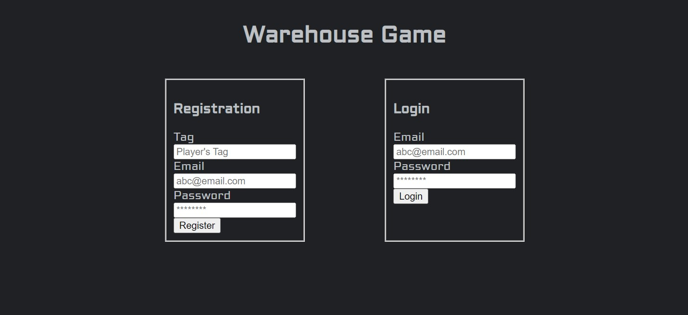
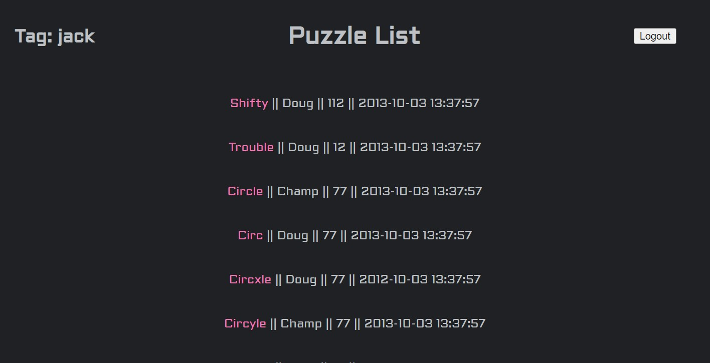
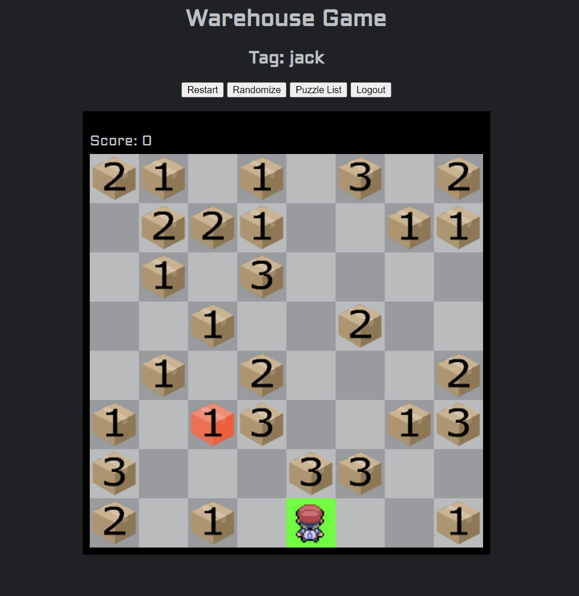

# WarehouseGameProj
A 2d game built using vanilla Javascript, HTML 5 and CSS with user authentication and serverside database integration using PHP

## Features:
- Log in page 
- User authentication through mySQL database
- Using mySQL database to generate a puzzle list 
- Unique player tags

## `Login`

## `Puzzle List`

## `Game`

## Some details
### `Login Page`
- The login page uses functions from [validate.php](https://github.com/Cryst67/WarehouseGameProj/blob/main/util/validate.php) to validate form data for user registeration and login
- Expected errors are handled by the [errorMap](https://github.com/Cryst67/WarehouseGameProj/blob/main/util/errorMap.php), letting the user know why an error occured
- Registration and logging out are handled by the [successMap](https://github.com/Cryst67/WarehouseGameProj/blob/main/util/successMap.php), informing the user of a successful process
- Registered users' tag, email and password are stored in a MySQL database for future authentication

### `PuzzleList`
- Puzzlelist page pulls data from the MySQL database to display each game's top scorer's tag, score and date of reaching top score.
- Logged in player's tag is displayed on the top left using PHP sessions to store user information
- Logout button on the top right logs player out by killing the current session using [logout.php](https://github.com/Cryst67/WarehouseGameProj/blob/main/sessions/logout.php)
- The puzzlelist page and game pages cannot be accessed without being logged in

### `Warehouse Game`
  - How to play the game
  - 
    - You control the player sprite, using [WASD](https://en.wikipedia.org/wiki/Arrow_keys#WASD_keys) to move. Moving to another tile adds 1 to the score
    -  To win the game, player needs to push the target crate (marked in red) of variable weight (1 ... 3) to beginning position, marked by the green tile
    -  Player cannot push crates with a total weight > 3
    -  If stuck, player can destroy crates using the [SPACEBAR](https://en.wikipedia.org/wiki/Space_bar) key, adding 100 to the score
    -  If target crate is stuck on the edge of the grid, game can be restarted using the restart button
  
 - One of each game element (image) is pulled on initial page load and hidden
 - Game is rendered using a static HTML canvas tag
 - Game can have a variable *n* x *n* grid of size (8 ... 12)
 - Target crate is guaranteed to not be initialized on the edge of the playable grid
